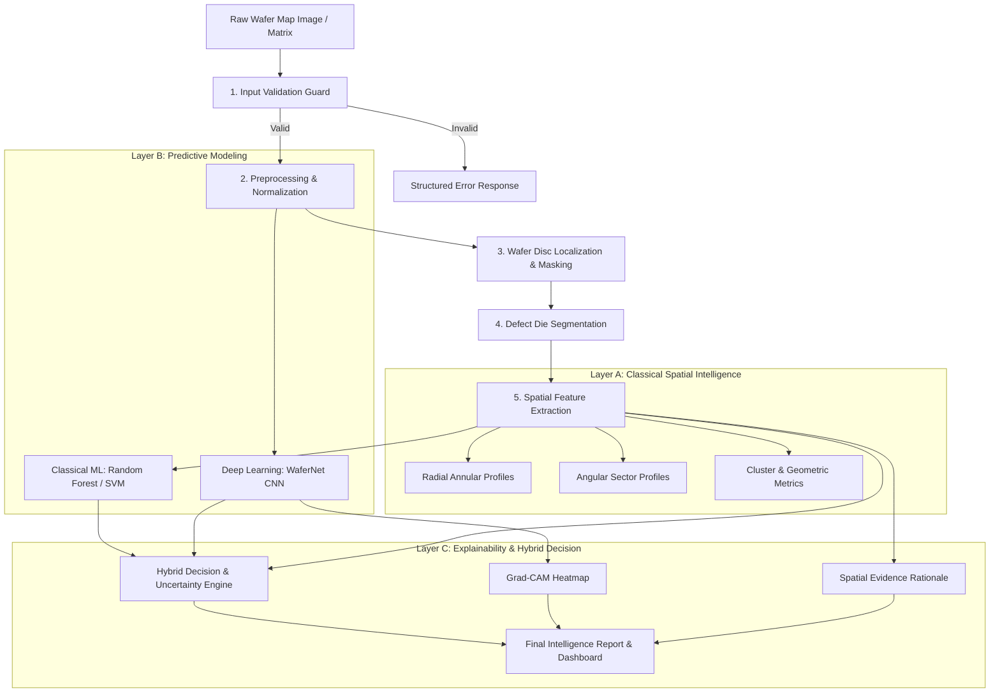

# System Architecture: Image-Based Wafer Map Pattern Intelligence

## 1. High-Level Architecture Overview



---

## 2. Component Deconstruction

### 2.1 Preprocessing & Segmentation Subsystem (`src/preprocessing/`, `src/segmentation/`)
- **`validator.py`**: Ensures image resolution $\ge 32\times32$, aspect ratio within tolerance, non-zero entropy, valid file headers.
- **`preprocessor.py`**: Bilateral/Gaussian filtering for background noise suppression, contrast stretching, and resolution normalization to $128\times128$.
- **`wafer_mask.py`**: Locates wafer circular boundary $[x_c, y_c, R]$ via Hough circle transform or convex boundary fitting to eliminate off-wafer carrier background.
- **`defect_segmenter.py`**: Applies adaptive thresholding and morphological filtering to isolate defect dies into a binary mask $M \in \{0, 1\}^{H \times W}$.

### 2.2 Spatial Feature Subsystem (`src/features/`)
Transforms the binary defect mask into a rich physical feature vector:
1. **Radial Densities ($D_{\text{rad}}$)**: Concentric rings $r_i \in [0, R]$, computing defective die count / total die count in ring $i$.
2. **Angular Distributions ($D_{\text{ang}}$)**: $12$ polar wedge bins ($30^\circ$ slices) around the wafer centroid.
3. **Center-vs-Edge Ratio ($R_{\text{c/e}}$)**: $\frac{\text{Defect Density}(r < 0.3R)}{\text{Defect Density}(r > 0.7R)}$.
4. **Cluster & Topology Metrics**: DBSCAN-based cluster count, largest cluster area ratio, convex hull solidity, defect eccentricity, and inertia tensor eigenvalues.

### 2.3 Machine Learning & Deep Learning Subsystem (`src/models/`)
- **Classical Model (`classical_ml.py`)**: Multi-class Random Forest / SVM trained exclusively on engineered spatial features.
- **Deep Learning Model (`cnn_model.py`)**: `WaferNet_Light` — 4-stage convolutional backbone with BatchNorm, ReLU, Dropout, and Global Average Pooling.
- **Hybrid Arbitration Engine (`hybrid_engine.py`)**:
  - Compares top-1 class probabilities from Classical ML ($P_{\text{ML}}$) and CNN ($P_{\text{CNN}}$).
  - Evaluates spatial rule alignment (e.g. if predicted "Edge", validates $R_{\text{c/e}} < 0.2$).
  - When $P_{\text{ML}}$ and $P_{\text{CNN}}$ match and confidence $> 0.65 \implies$ high-confidence classification.
  - When models disagree or confidence $< 0.55 \implies$ tags output as `UNCERTAIN / NEEDS REVIEW`.

### 2.4 Explainability Subsystem (`src/explainability/`)
- **`gradcam.py`**: Hooks into the final convolutional layer of `WaferNet_Light` to compute gradients of class scores with respect to feature activation maps.
- **`spatial_rationale.py`**: Synthesizes rule-based domain justifications comparing the target wafer's spatial metrics to baseline reference distributions.

### 2.5 Inspection Dashboard Subsystem (`app/`)
- Streamlit application displaying:
  - Wafer image ingestion & synthetic test wafer generator.
  - 4-panel visual pipeline: Raw Input $\rightarrow$ Segmented Disk $\rightarrow$ Defect Mask $\rightarrow$ Grad-CAM overlay.
  - Interactive polar defect density radar chart.
  - Hybrid prediction scoreboard with certainty indicators and spatial rationale summary.

---

## 3. Directory Layout & Module Organization

```text
Image-Based Wafer Map Pattern Intelligence/
├── data/
│   ├── raw/                 # Original wafer maps / WM-811K or synthetic samples
│   ├── processed/           # Normalized wafer matrices
│   └── splits/              # train.csv, val.csv, test.csv
├── configs/
│   └── config.yaml          # Master configuration parameters
├── notebooks/
│   ├── 01_data_exploration.ipynb
│   ├── 02_spatial_feature_analysis.ipynb
│   └── 03_model_prototyping.ipynb
├── src/
│   ├── __init__.py
│   ├── utils/
│   │   ├── __init__.py
│   │   ├── logger.py
│   │   └── seed.py
│   ├── preprocessing/
│   │   ├── __init__.py
│   │   ├── validator.py
│   │   ├── preprocessor.py
│   │   └── dataset.py
│   ├── segmentation/
│   │   ├── __init__.py
│   │   ├── wafer_mask.py
│   │   └── defect_segmenter.py
│   ├── features/
│   │   ├── __init__.py
│   │   ├── spatial.py
│   │   ├── radial.py
│   │   ├── density.py
│   │   └── extractor.py
│   ├── models/
│   │   ├── __init__.py
│   │   ├── base.py
│   │   ├── classical_ml.py
│   │   ├── cnn_model.py
│   │   └── hybrid_engine.py
│   ├── explainability/
│   │   ├── __init__.py
│   │   ├── gradcam.py
│   │   └── spatial_rationale.py
│   ├── evaluation/
│   │   ├── __init__.py
│   │   ├── metrics.py
│   │   ├── ablation.py
│   │   └── robustness.py
│   └── visualization/
│       ├── __init__.py
│       ├── wafer_plots.py
│       └── radial_plots.py
├── app/
│   └── app.py               # Interactive Streamlit analytics dashboard
├── tests/
│   ├── __init__.py
│   ├── test_validator.py
│   ├── test_segmentation.py
│   ├── test_features.py
│   └── test_hybrid_engine.py
├── reports/                 # Evaluation figures & ablation tables
├── results/                 # Serialized model weights & metric logs
├── docs/                    # Architectural & mathematical documentation
├── requirements.txt
├── README.md
├── PROJECT_SPEC.md
├── REQUIREMENTS.md
├── ARCHITECTURE.md
├── DECISIONS.md
├── TASKS.md
└── AI_RULES.md
```
