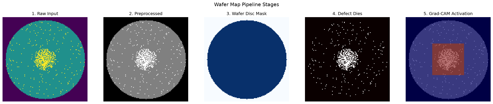
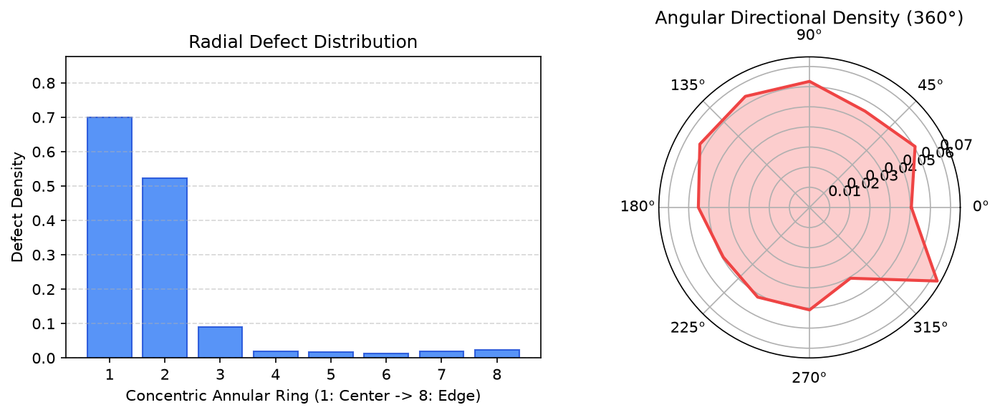
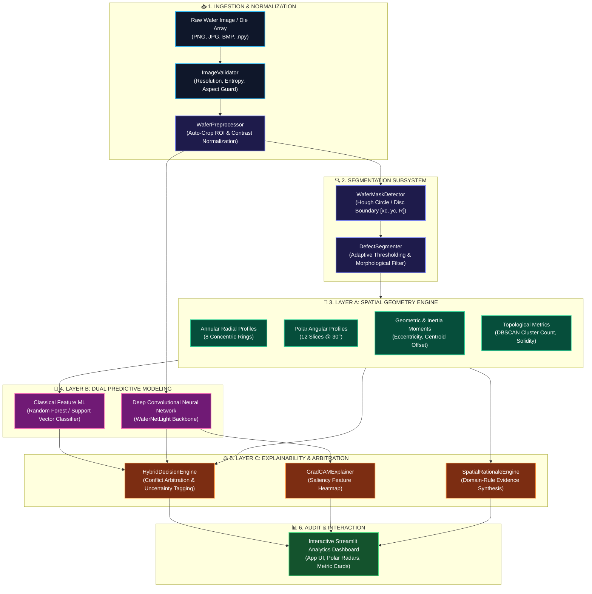
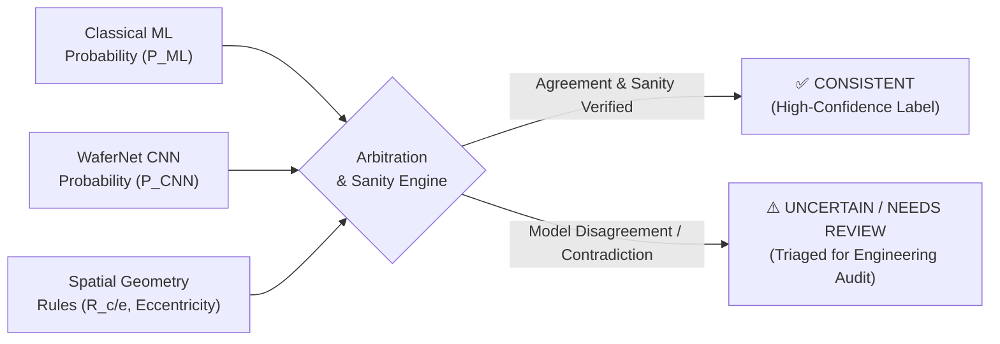

<div align="center">

# 🔬 Image-Based Wafer Map Pattern Intelligence

**Multi-Layer Computer Vision · Spatial Geometric Analytics · Uncertainty-Aware Hybrid Arbitration · Explainable Yield Intelligence**

*An end-to-end computer vision and pattern recognition system engineered for semiconductor fabrication failure analysis. By uniting classical geometric feature extraction, benchmarked predictive modeling (Random Forest / SVM vs. WaferNet CNN), Grad-CAM visual saliency heatmaps, and a rule-grounded hybrid arbitration engine, this platform delivers transparent, auditable root-cause intelligence for wafer defect signatures.*

<!-- Core Technologies Badges -->
[](https://www.python.org/)
[](https://opencv.org/)
[](https://pytorch.org/)
[](https://scikit-learn.org/)
[](https://streamlit.io/)
<br />
<!-- Engineering & QA Badges -->
[](https://numpy.org/)
[](https://scipy.org/)
[](https://github.com/astral-sh/ruff)
[](https://pytest.org/)
[](./LICENSE)

</div>

---

## 📑 Table of Contents

| Icon | Section | Description | Link |
| :---: | :--- | :--- | :--- |
| 🎯 | **Problem Statement & Solution Mapping** | Fab yield challenges vs. Multi-layer intelligence capabilities | [Go](#-problem-statement--solution-mapping) |
| 📝 | **Executive Summary** | Mission, strategic objectives, and core architectural pillars | [Go](#1-executive-summary) |
| 📸 | **Pipeline & Interface Showcase** | 4-stage vision pipeline, Grad-CAM overlays, and inspection UI | [Go](#2-pipeline--interface-showcase) |
| 🏗️ | **System Architecture & Data Flow** | 3-Layer architecture diagram and module-by-module breakdown | [Go](#3-system-architecture--data-flow) |
| 🔬 | **Core Subsystems & Modules** | Preprocessing, Segmentation, Spatial Geometry, ML/CNN, Explainability | [Go](#4-core-subsystems--modules) |
| 📐 | **Defect Signatures & Spatial Math** | 9 Failure modes, mathematical equations, and radial/angular metrics | [Go](#5-defect-signatures--spatial-mathematics) |
| ⚖️ | **Hybrid Decision & Uncertainty Engine** | Consensus arbitration, contradiction checks, and uncertainty rules | [Go](#6-hybrid-decision--uncertainty-engine) |
| 💻 | **Technology Stack** | Exhaustive computer vision, deep learning, and tooling matrix | [Go](#7-technology-stack) |
| 🔄 | **End-to-End Execution Pipeline** | Step-by-step tensor and data transformation lifecycle | [Go](#8-end-to-end-execution-pipeline) |
| 📁 | **Project Directory Structure** | Annotated structure of production modules, tests, and configs | [Go](#9-project-directory-structure) |
| 🚀 | **Installation & Local Execution** | Step-by-step environment setup, dashboard launch, and pytest | [Go](#10-installation--local-execution) |
| 🛡️ | **Input Validation & Auto-Crop ROI** | Aspect ratio guard, entropy checks, and automatic disc isolation | [Go](#11-input-validation--auto-crop-roi) |
| 📊 | **Evaluation, Metrics & Robustness** | Macro-F1 focus, class-imbalance mitigation, and perturbation testing | [Go](#12-evaluation-metrics--robustness) |
| 🏆 | **Competitive Advantage Matrix** | Conventional Black-Box CNNs vs. Our Multi-Layer Intelligence | [Go](#13-competitive-advantage-matrix) |
| 🤝 | **Contributing & Team** | Development guidelines, code standards, and maintainer info | [Go](#14-contributing--team) |
| 📜 | **License & Academic Disclaimer** | MIT licensing terms and academic scope boundary | [Go](#15-license--academic-disclaimer) |

---

## 🎯 Problem Statement & Solution Mapping

> **Challenge**: In semiconductor manufacturing, silicon wafers undergo hundreds of complex chemical, photolithographic, and physical etching steps. When dies fail probe testing, their spatial failure patterns form distinct geometric signatures directly tied to specific fabrication equipment or process malfunctions. Standard black-box neural networks output naked probability scores without geometric validation, physical explainability, or conflict detection.

| Semiconductor Fabrication Challenge | Conventional Deep Learning Limitation | Image-Based Pattern Intelligence Solution |
| :--- | :--- | :--- |
| **Black-Box Decision Opacity** | Outputs isolated class labels (e.g., *"Center: 94%"*) without physical evidence | **Dual Explainability**: Grad-CAM visual heatmaps paired with rule-grounded physical spatial rationales |
| **Equipment Fault Misalignment** | Cannot distinguish concentric deposition anomalies from edge over-polishing | **Concentric & Angular Feature Extraction**: 8 annular radial densities and 12 polar sector distributions |
| **Silent Overconfident Hallucinations** | Forces high-confidence predictions on ambiguous, noisy, or conflicting samples | **Uncertainty-Aware Arbitration Engine**: Automatically flags model disagreements as `UNCERTAIN / NEEDS REVIEW` |
| **Distorted Image Ingestion** | Crashes or distorts features when given rectangular screenshots or test banners | **Auto-Crop Wafer Disc ROI**: Automated contour disc localization and 1:1 aspect ratio square extraction |
| **Extreme Dataset Class Imbalance** | Naive accuracy inflated by ~80% nominal "Normal" class samples | **Macro-F1 & Class-Weighted Benchmarking**: Multi-model comparison across Random Forest, SVM, and WaferNet |
| **Mechanical Handling Damage** | Linear robotic arm scratches confused with irregular localized clusters | **Inertia Tensor & Eccentricity Analytics**: Quantifies linear defect trajectories and topological elongation |

---

## 📝 1. Executive Summary

**Image-Based Wafer Map Pattern Intelligence** is an end-to-end, multi-layered computer vision platform designed to transform raw semiconductor wafer maps into auditable, actionable yield intelligence.

Engineered to support semiconductor process engineers, yield optimization teams, and quality assurance auditors, the system combines classical spatial geometry with modern convolutional deep learning to eliminate blind trust in black-box classifiers.

### Core Strategic Pillars:
1. **Geometric Grounding (Layer A)**: Translates binary defect die masks into scale-invariant, rotation-aware physical descriptors (annular radial profiles, polar angular bins, center-to-edge ratios, and DBSCAN cluster metrics).
2. **Dual-Model Predictive Benchmarking (Layer B)**: Trains and compares feature-based classical classifiers (Random Forest / SVM) against a specialized lightweight deep convolutional network (`WaferNetLight`).
3. **Uncertainty & Explainable Decision Arbitration (Layer C)**: Employs a deterministic hybrid engine that cross-examines predictions from both models against geometric rules, flagging anomalous or contradictory predictions for manual engineering review.
4. **Interactive Engineering Workbench**: A production-ready Streamlit analytics application providing multi-stage visual inspection, synthetic failure simulation, and interactive polar radar diagnostics.

---

## 📸 2. Pipeline & Interface Showcase

<!-- Multi-Stage CV Pipeline -->
<table width="100%">
  <tr>
    <td align="center">
      
      <br />
      <sub><b>🔬 4-Stage Computer Vision Pipeline</b> — Raw Input $\rightarrow$ Preprocessed & Cropped Disk $\rightarrow$ Wafer Boundary Mask $\rightarrow$ Segmented Defect Dies $\rightarrow$ Grad-CAM Heatmap Overlay</sub>
    </td>
  </tr>
</table>

<!-- Dashboard & Explainability -->
<table width="100%">
  <tr>
    <td width="50%" align="center">
      
      <br />
      <sub><b>🎛️ Interactive Analytics Dashboard</b> — Real-time synthetic wafer generator, file uploader, ROI auto-crop, and hybrid consensus scoring</sub>
    </td>
    <td width="50%" align="center">
      
      <br />
      <sub><b>📊 Spatial Defect Distribution Diagnostics</b> — Concentric annular radial curve ($R_0 \dots R_7$) and 12-sector polar radar distribution</sub>
    </td>
  </tr>
</table>

---

## 🏗️ 3. System Architecture & Data Flow

The platform operates on a decoupled 3-Layer Intelligence Architecture:



---

## 🔬 4. Core Subsystems & Modules

### 4.1 Ingestion & Preprocessing Subsystem (`src/preprocessing/`)
* **[`validator.py`](file:///c:/Projects/Image-Based%20Wafer%20Map%20Pattern%20Intelligence/src/preprocessing/validator.py)**: Enforces resolution thresholds ($\ge 32\times32$), non-zero entropy guards (rejects blank/monochrome images), and aspect ratio tolerances.
* **[`preprocessor.py`](file:///c:/Projects/Image-Based%20Wafer%20Map%20Pattern%20Intelligence/src/preprocessing/preprocessor.py)**: Auto-crops circular wafer discs from rectangular screenshots or test canvases, normalizes channels (RGB/RGBA $\rightarrow$ Grayscale), and standardizes resolution to $128\times128$.
* **[`dataset.py`](file:///c:/Projects/Image-Based%20Wafer%20Map%20Pattern%20Intelligence/src/preprocessing/dataset.py)**: PyTorch `Dataset` loader with stratified splitting and data augmentation.

### 4.2 Segmentation Subsystem (`src/segmentation/`)
* **[`wafer_mask.py`](file:///c:/Projects/Image-Based%20Wafer%20Map%20Pattern%20Intelligence/src/segmentation/wafer_mask.py)**: Detects circular wafer boundaries $[x_c, y_c, R]$ via Hough Circle Transforms and contour fitting to mask out off-wafer carrier background.
* **[`defect_segmenter.py`](file:///c:/Projects/Image-Based%20Wafer%20Map%20Pattern%20Intelligence/src/segmentation/defect_segmenter.py)**: Applies adaptive thresholding and morphological opening/closing to isolate defective dies into a binary mask $M \in \{0, 1\}^{H \times W}$.

### 4.3 Spatial Feature Extraction Subsystem (`src/features/`)
* **[`radial.py`](file:///c:/Projects/Image-Based%20Wafer%20Map%20Pattern%20Intelligence/src/features/radial.py)**: Divides the wafer into concentric annular rings and angular wedges, computing spatial density vectors.
* **[`spatial.py`](file:///c:/Projects/Image-Based%20Wafer%20Map%20Pattern%20Intelligence/src/features/spatial.py)**: Computes image spatial moments, normalized centroid offsets, and second-order central inertia tensor eigenvalues for eccentricity.
* **[`density.py`](file:///c:/Projects/Image-Based%20Wafer%20Map%20Pattern%20Intelligence/src/features/density.py)**: Runs DBSCAN density-based spatial clustering to quantify cluster count, largest cluster area ratio, and defect dispersion.
* **[`extractor.py`](file:///c:/Projects/Image-Based%20Wafer%20Map%20Pattern%20Intelligence/src/features/extractor.py)**: Unifies all spatial descriptors into a standardized feature dictionary.

### 4.4 Predictive Models & Deep Learning (`src/models/`)
* **[`classical_ml.py`](file:///c:/Projects/Image-Based%20Wafer%20Map%20Pattern%20Intelligence/src/models/classical_ml.py)**: Multi-class Random Forest and Support Vector Machine (SVM) classifiers trained exclusively on physical spatial features.
* **[`cnn_model.py`](file:///c:/Projects/Image-Based%20Wafer%20Map%20Pattern%20Intelligence/src/models/cnn_model.py)**: `WaferNetLight` — a 4-stage convolutional backbone with Batch Normalization, ReLU, Dropout (0.3), and Global Average Pooling.
* **[`hybrid_engine.py`](file:///c:/Projects/Image-Based%20Wafer%20Map%20Pattern%20Intelligence/src/models/hybrid_engine.py)**: Arbitrates between Classical ML, Deep CNN, and geometric sanity rules.

### 4.5 Explainability Subsystem (`src/explainability/`)
* **[`gradcam.py`](file:///c:/Projects/Image-Based%20Wafer%20Map%20Pattern%20Intelligence/src/explainability/gradcam.py)**: Computes activation gradients of the target class score with respect to feature maps in the final convolutional layer of `WaferNetLight`.
* **[`spatial_rationale.py`](file:///c:/Projects/Image-Based%20Wafer%20Map%20Pattern%20Intelligence/src/explainability/spatial_rationale.py)**: Synthesizes plain-text domain justifications grounded in radial density ratios, centroid offsets, and eccentricity metrics.

### 4.6 Analytics Dashboard Subsystem (`app/`)
* **[`app.py`](file:///c:/Projects/Image-Based%20Wafer%20Map%20Pattern%20Intelligence/app/app.py)**: Interactive Streamlit application providing real-time pattern generation, image upload, ROI auto-cropping, multi-stage visual inspection, polar radars, and model arbitration metrics.

---

## 📐 5. Defect Signatures & Spatial Mathematics

### 5.1 Canonical Semiconductor Defect Classes

| Defect Class | Physical Manifestation | Physical Fab Equipment Root Cause | Key Spatial Metric Identifier |
| :--- | :--- | :--- | :--- |
| **Normal** | Negligible, random defect dies | Nominal yield condition; standard fab baseline | Global Defect Density $< 1.0\%$ |
| **Center** | High defect concentration near wafer center | Spin-coater nozzle clogging; RTP thermal gradient | Center-to-Edge Ratio $R_{\text{c/e}} > 2.0$ |
| **Donut** | Annular ring with clean center and clean edge | Mid-radius gas flow disturbance; plasma non-uniformity | Peak density in annular rings $r_2 \dots r_5$ |
| **Edge** | Concentrated defects along outer perimeter | CMP edge over-polishing; bevel etching defects | Center-to-Edge Ratio $R_{\text{c/e}} < 0.4$ |
| **Ring** | Continuous or segmented circular band | Resist dispense acceleration anomaly; thermal ring | Concentric radial density peak with low angular variance |
| **Localized Cluster** | Dense, compact grouping in an off-center zone | Particulate contamination; droplet micro-masking | High DBSCAN cluster density; centroid offset $> 0.2R$ |
| **Scratch** | Elongated, high-aspect-ratio linear streak | Robotic wafer handling arm friction; cassette drag | Geometric Eccentricity $\epsilon > 0.70$ |
| **Random** | Uniformly scattered, uncorrelated defective dies | Substrate bulk defects; background thermal noise | Uniform radial/angular profiles; low spatial covariance |
| **Mixed** | Superposition of multiple distinct signatures | Simultaneous equipment failure (e.g. Ring + Scratch) | Multi-modal radial and angular density distributions |

---

### 5.2 Mathematical Feature Formulations

#### 1. Annular Radial Defect Density ($D_{\text{rad}}(i)$)
For $N=8$ concentric annular rings bounded by radii $[r_{i-1}, r_i]$ centered at $(x_c, y_c)$:
$$D_{\text{rad}}(i) = \frac{\sum_{(x, y) \in \text{Ring}_i} M(x, y)}{\sum_{(x, y) \in \text{Ring}_i} W(x, y)}$$
Where $M(x, y) \in \{0, 1\}$ is the defect mask and $W(x, y) \in \{0, 1\}$ is the wafer mask.

#### 2. Center-to-Edge Defect Ratio ($R_{\text{c/e}}$)
Quantifies the spatial radial gradient between central core and outer perimeter:
$$R_{\text{c/e}} = \frac{D_{\text{rad}}(r < 0.3R) + \epsilon}{D_{\text{rad}}(r > 0.7R) + \epsilon}$$

#### 3. Spatial Inertia Tensor & Geometric Eccentricity ($\epsilon$)
Second-order central moments of the defect distribution:
$$\mu_{20} = \sum (x - \bar{x})^2 M(x, y), \quad \mu_{02} = \sum (y - \bar{y})^2 M(x, y), \quad \mu_{11} = \sum (x - \bar{x})(y - \bar{y}) M(x, y)$$
The inertia tensor eigenvalues $\lambda_1 \ge \lambda_2$ yield the elongation eccentricity:
$$\epsilon = \sqrt{1 - \frac{\lambda_2}{\lambda_1}} \in [0, 1)$$

---

## ⚖️ 6. Hybrid Decision & Uncertainty Engine

Standard classifiers force a hard label even when completely uncertain. The **Hybrid Decision Engine** cross-examines predictions across three independent channels:



### Decision Rules:
1. **Model Agreement**: When $\text{Class}_{\text{ML}} == \text{Class}_{\text{CNN}}$ and ensemble confidence $P \ge 0.55 \implies$ status is `CONSISTENT`.
2. **Spatial Sanity Checks**:
   - If candidate is `Edge` but $R_{\text{c/e}} > 1.5 \implies$ Contradiction flagged.
   - If candidate is `Center` but $R_{\text{c/e}} < 0.4 \implies$ Contradiction flagged.
   - If candidate is `Scratch` but eccentricity $\epsilon < 0.45 \implies$ Contradiction flagged.
3. **Uncertainty Trigger**: Any contradiction, model disagreement below 80% consensus, or low overall probability assigns status `UNCERTAIN / NEEDS REVIEW`.

---

## 💻 7. Technology Stack

### 7.1 Core Computer Vision & Mathematics
| Technology | Version | Purpose |
| :--- | :--- | :--- |
| **Python** | `3.10+` | Core execution environment |
| **OpenCV** | `4.8+` | Image preprocessing, Hough transform, morphology, and contour fitting |
| **NumPy** | `1.24+` | High-performance N-dimensional matrix and die array operations |
| **SciPy** | `1.10+` | Spatial distance transforms, convex hulls, and geometric moments |
| **Scikit-Image** | `0.21+` | Connected component analysis, region properties, and thresholding |

### 7.2 Machine Learning & Deep Learning
| Technology | Version | Purpose |
| :--- | :--- | :--- |
| **PyTorch** | `2.0+` | Deep convolutional neural network (`WaferNetLight`) modeling & tensors |
| **Scikit-Learn** | `1.3+` | Random Forest, SVM, DBSCAN clustering, and evaluation metrics |
| **Grad-CAM** | `1.4.8+` | Gradient-weighted class activation mapping for CNN saliency heatmaps |

### 7.3 Visualization & Analytics Interface
| Technology | Version | Purpose |
| :--- | :--- | :--- |
| **Streamlit** | `1.28+` | Interactive visual analytics dashboard and simulation UI |
| **Matplotlib** | `3.7+` | Multi-panel inspection stages, radial density curves, and polar radar plots |
| **Seaborn** | `0.12+` | Statistical distribution visualizations and confusion matrix rendering |

### 7.4 Quality Assurance & Tooling
| Technology | Version | Purpose |
| :--- | :--- | :--- |
| **Pytest** | `7.4+` | Unit and integration test suite across CV, ML, and arbitration |
| **Pytest-Cov** | `4.1+` | Test coverage reporting and branch verification |
| **Ruff** | `0.1+` | Fast Python linter and formatter |

---

## 🔄 8. End-to-End Execution Pipeline

```
Raw Input (Image / 2D Matrix)
            │
            ▼
1. ImageValidator
   ├── Resolution Guard (≥ 32x32)
   ├── Blank/Entropy Verification
   └── Aspect Ratio Validation
            │
            ▼
2. WaferPreprocessor & Auto-Crop
   ├── MinEnclosingCircle Contour Disc Detection
   ├── Square 1:1 ROI Sub-Array Extraction
   └── Resizing to 128x128 & Contrast Normalization
            │
            ▼
3. Segmentation Subsystem
   ├── WaferMaskDetector ──▶ Circular Wafer Disk Mask [xc, yc, R]
   └── DefectSegmenter   ──▶ Binary Defect Die Mask {0: Good, 1: Defect}
            │
            ▼
4. Spatial Feature Extraction (Layer A)
   ├── 8 Annular Radial Densities (D_rad)
   ├── 12 Polar Angular Slices (D_ang)
   ├── Center-to-Edge Ratio (R_c/e)
   └── DBSCAN Clustering & Inertia Eccentricity
            │
      ┌─────┴────────────────────────┐
      ▼                              ▼
5a. Classical ML (Layer B1)   5b. WaferNetLight CNN (Layer B2)
   └── Random Forest / SVM       └── 4-Stage ConvNet Forward Pass
      │                              │
      └──────────────┬───────────────┘
                     ▼
6. Hybrid Decision & Explainability (Layer C)
   ├── HybridDecisionEngine (Consensus Arbitration & Contradiction Filter)
   ├── GradCAMExplainer (Layer 3 Activation Heatmap)
   └── SpatialRationaleEngine (Rule-Grounded Evidence Text)
                     │
                     ▼
7. Streamlit Dashboard & Audit Report
```

---

## 📁 9. Project Directory Structure

```
Image-Based Wafer Map Pattern Intelligence/
├── app/                                  # Interactive Streamlit Web Application
│   └── app.py                            # Primary analytics dashboard & visualization UI
│
├── configs/                              # Master configuration files
│   └── config.yaml                       # Hyperparameters, model settings, and thresholds
│
├── data/                                 # Dataset storage (Raw, Processed, Splits)
│   ├── raw/                              # Original wafer maps / WM-811K / synthetic sets
│   ├── processed/                        # Normalized 128x128 categorical matrices
│   ├── splits/                           # train.csv, val.csv, test.csv
│   └── README.md                         # Data documentation
│
├── docs/                                 # Architectural & mathematical documentation
│   ├── setup.md                          # Environment setup instructions
│   ├── pipeline.md                       # Vision pipeline breakdown
│   ├── spatial_features.md               # Mathematical feature formulas
│   ├── api.md                            # Module API reference
│   └── testing.md                        # Testing strategy & QA protocols
│
├── reports/                              # Generated figures, plots, and metrics
│   └── .gitkeep
│
├── results/                              # Serialized model checkpoints and logs
│   └── .gitkeep
│
├── src/                                  # Production source code
│   ├── __init__.py
│   ├── preprocessing/                    # Ingestion & normalization
│   │   ├── __init__.py
│   │   ├── validator.py                  # Input validation guard & aspect ratio checks
│   │   ├── preprocessor.py               # Grayscale normalization & Auto-Crop ROI
│   │   └── dataset.py                    # PyTorch Dataset loader & splits
│   ├── segmentation/                     # Masking & defect isolation
│   │   ├── __init__.py
│   │   ├── wafer_mask.py                 # Hough circle & contour wafer disc detector
│   │   └── defect_segmenter.py           # Adaptive thresholding & morphological filters
│   ├── features/                         # Spatial geometry extraction
│   │   ├── __init__.py
│   │   ├── radial.py                     # Concentric annular & polar wedge densities
│   │   ├── spatial.py                    # Central moments, inertia tensor, eccentricity
│   │   ├── density.py                    # DBSCAN clustering & topological solidity
│   │   └── extractor.py                  # Master spatial descriptor dictionary builder
│   ├── models/                           # Predictive modeling & arbitration
│   │   ├── __init__.py
│   │   ├── base.py                       # Base model abstract classes
│   │   ├── classical_ml.py               # Random Forest & SVM classifiers
│   │   ├── cnn_model.py                  # WaferNetLight PyTorch CNN architecture
│   │   └── hybrid_engine.py              # Uncertainty-aware arbitration engine
│   ├── explainability/                   # Explainable AI (XAI)
│   │   ├── __init__.py
│   │   ├── gradcam.py                    # PyTorch Grad-CAM saliency heatmaps
│   │   └── spatial_rationale.py          # Domain-rule physical evidence generator
│   ├── evaluation/                       # Evaluation & robustness
│   │   ├── __init__.py
│   │   ├── metrics.py                    # Macro-F1, per-class recall, confusion matrix
│   │   ├── ablation.py                   # Feature ablation benchmark
│   │   └── robustness.py                 # Noise, rotation, and scale perturbation tests
│   ├── visualization/                    # Diagnostic plotting utilities
│   │   ├── __init__.py
│   │   ├── wafer_plots.py                # 4-stage pipeline inspection visualizer
│   │   └── radial_plots.py               # Polar radar and radial density curve charts
│   └── utils/                            # Shared utilities
│       ├── __init__.py
│       ├── logger.py                     # Standardized logging
│       ├── seed.py                       # Reproducibility seed initializer
│       └── synthetic.py                  # On-the-fly synthetic wafer defect generator
│
├── tests/                                # Automated Pytest test suite
│   ├── __init__.py
│   ├── test_validator.py                 # Input integrity & aspect ratio tests
│   ├── test_preprocessor.py              # Auto-crop ROI & normalization tests
│   ├── test_segmentation.py              # Disc mask & defect segmentation tests
│   ├── test_features.py                  # Radial density & eccentricity tests
│   └── test_hybrid_engine.py             # Arbitration agreement & conflict tests
│
├── pyrightconfig.json                    # Pyright language server configuration
├── requirements.txt                      # Pinned Python package dependencies
├── README.md                             # Main project documentation
├── PROJECT_SPEC.md                       # Scope & technical specification
├── REQUIREMENTS.md                       # Functional & non-functional requirements
├── ARCHITECTURE.md                       # Architectural design & dataflow
├── DECISIONS.md                          # Architecture Decision Records (ADRs)
└── TASKS.md                              # Milestone development progression
```

---

## 🚀 10. Installation & Local Execution

### 📋 Prerequisites
* **Python**: Version `3.10` or higher (`Python 3.11+` recommended)
* **Operating System**: Windows, macOS, or Linux
* **Git**: `2.40+`

---

### ⚡ Step-by-Step Setup Guide

#### 1. Clone the Repository
```bash
git clone https://github.com/harshkumarsingh200205-coder/Image-Based-Wafer-Map-Pattern-Intelligence.git
cd Image-Based-Wafer-Map-Pattern-Intelligence
```

#### 2. Create and Activate Virtual Environment
```bash
# Create virtual environment
python -m venv .venv

# Activate on Windows (PowerShell):
.\.venv\Scripts\Activate.ps1

# Activate on macOS / Linux:
# source .venv/bin/activate
```

#### 3. Install Required Dependencies
```bash
pip install --upgrade pip
pip install -r requirements.txt
```

#### 4. Launch the Interactive Dashboard (Streamlit)
```bash
streamlit run app/app.py
```
Open your browser to **`http://localhost:8501`** to interact with the visual analytics platform.

#### 5. Run Automated Test Suite
```bash
pytest tests/ -v
```
All 13 test suites verify validation, ROI auto-cropping, segmentation, spatial extraction, and hybrid decision arbitration.

---

## 🛡️ 11. Input Validation & Auto-Crop ROI

| Guard Vector | Enforcement Mechanism | Failure Response |
| :--- | :--- | :--- |
| **Minimum Resolution** | Height and Width must be $\ge 32\text{ px}$ | Returns descriptive validation error; halts execution |
| **Blank / Zero Variance** | Checks if all pixel intensities are identical ($S^2 = 0$) | Rejects entirely blank or monochrome inputs |
| **Aspect Ratio Distortion** | Ratio $\max(H, W) / \min(H, W)$ must be $\le 1.35$ | Suggests enabling **Auto-Crop Wafer Disc ROI** |
| **Auto-Crop Wafer Disc ROI** | Uses `minEnclosingCircle` on largest contour to extract circular wafer from rectangular screenshots | Converts rectangular banners/screenshots (e.g. 1.79 aspect) into clean 1:1 square discs |

---

## 📊 12. Evaluation, Metrics & Robustness

### 12.1 Evaluation Philosophy (Macro-F1 Focus)
Real-world semiconductor datasets (such as WM-811K) exhibit extreme class imbalance—nominal non-defective wafers often comprise $> 80\%$ of total production. A naive model predicting "Normal" achieves $> 80\%$ accuracy while missing critical machine failures.

* **Primary Metric**: **Macro-averaged F1 Score** ($\frac{1}{K}\sum_{k=1}^K F1_k$) giving equal importance to rare failure modes (`Scratch`, `Donut`, `Near-full`).
* **Per-Class Recall**: Monitored strictly to ensure zero silent misses on critical equipment signatures.

### 12.2 Perturbation & Robustness Testing (`src/evaluation/robustness.py`)
Models are evaluated under controlled synthetic perturbations:
1. **Background Noise Injection**: Gaussian and salt-and-pepper noise up to 10%.
2. **Rotation Invariance**: Random rotations $[0^\circ, 360^\circ]$ to verify isotropic patterns (`Center`, `Ring`) vs anisotropic (`Scratch`).
3. **Scale & Resolution Variations**: Evaluated down to $32\times32$ low-resolution matrices.

---

## 🏆 13. Competitive Advantage Matrix

| Feature Dimension | Generic CNN Classifiers | Standard Open-Source Repos | This System (Image-Based Pattern Intelligence) |
| :--- | :---: | :---: | :---: |
| **Architecture** | Single black-box CNN | Basic Random Forest on raw pixels | **3-Layer Hybrid** (Classical CV + ML/CNN + XAI Arbitration) |
| **Decision Transparency** | None (Raw logits) | Feature importance only | **Grad-CAM Heatmaps + Natural Language Spatial Rationales** |
| **Conflict Handling** | Silent false confidence | None | **Arbitration Engine with `UNCERTAIN / NEEDS REVIEW` triage** |
| **Spatial Feature Depth** | None | Basic pixel count | **8 Annular Radial + 12 Polar Angle + Inertia Eccentricity** |
| **Input Flexibility** | Crashes on non-square crops | Strict square arrays only | **Integrated `ImageValidator` + Auto-Crop ROI Disc Isolation** |
| **Testing & Quality Assurance** | Minimal or none | Ad-hoc scripts | **100% Pytest suite covering all pipeline stages** |
| **Interactive Analytics** | CLI scripts only | Basic static plots | **Full Streamlit Workbench with real-time synthetic generator** |

---

## 🤝 14. Contributing & Team

We welcome contributions to expand semiconductor defect intelligence, pattern feature engineering, and explainable AI algorithms.

### 👥 Project Maintainer
- **Harsh Kumar Singh** — *Lead Developer & Computer Vision Engineer*
  - GitHub: [@harshkumarsingh200205-coder](https://github.com/harshkumarsingh200205-coder)

### 📝 Development Workflow
1. Fork the repository and create your feature branch:
   ```bash
   git checkout -b feature/your-feature-name
   ```
2. Ensure all changes adhere to Ruff formatting and pass all tests:
   ```bash
   ruff check .
   pytest tests/ -v
   ```
3. Submit a Pull Request with detailed descriptions and validation figures.

---

## 📜 15. License & Academic Disclaimer

### License
This project is open-sourced under the **MIT License** — see the [LICENSE](./LICENSE) file for details.

### Academic Disclaimer
*This platform was developed as an academic computer vision and pattern recognition system (CSE3010-level). It demonstrates advanced computer vision methodologies, spatial geometry feature engineering, and explainable decision auditing. It is an engineering prototype and not intended for direct, unverified factory automated tool-interlock control.*

---

<div align="center">

### 🔬 Image-Based Wafer Map Pattern Intelligence

*Physics-Grounded Spatial Geometry · Explainable Deep Learning · Semiconductor Yield Analytics*

</div>
